# Cadence

Cadence is a single-user personal finance dashboard built around a twice-monthly pay
cycle instead of the generic calendar month. Budgets, safe-to-spend, goal roadmaps,
and the affordability check are all computed per pay period — **Period A: 1st–15th**
and **Period B: 16th–end of month** — so the numbers match how you actually get paid.

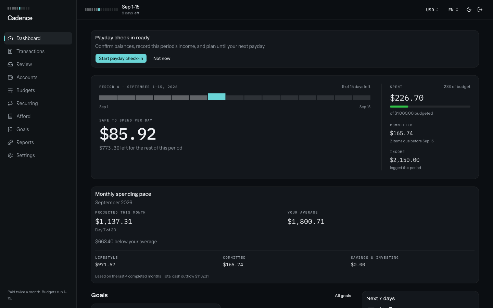

*Every screenshot in this README was captured against a throwaway database seeded
with fictional data.*

## Why Cadence

Most budgeting apps assume one paycheck a month. Cadence assumes two, and builds
everything else around that:

- Twice-monthly budgeting, split cleanly at the 1st–15th and 16th–end boundaries
  (a payday that lands on a weekend is treated as the Friday before)
- A guided payday check-in that reconciles balances, records income, and plans each
  period's protected buffer per account and its category allocations
- A safe-to-spend-per-day figure computed from the period budget and what's already
  been spent
- Recurring subscriptions and contributions that post themselves on their due
  dates, so the ledger stays current without retyping the same charges
- An Afford calculator that checks whether an installment purchase fits every pay
  period it lands in before you commit to it
- Savings goals with a per-pay-period contribution roadmap, funded from real
  accounts
- Multi-currency support (DOP, USD, and EUR as first-class currencies) with cached
  USD-based exchange rates — changing your display currency only changes how
  figures are presented, never the currency a transaction was recorded in
- Manual entry and CSV import as the baseline, with optional Gmail/Outlook
  review-based automation on top
- English and Spanish interface localization, dark and light themes
- A single-user, privacy-conscious design: no multi-tenant accounts, and nothing
  enters the ledger that you did not set up yourself. Review happens when you
  create and confirm a plan — a recurring item, an Afford installment plan, a
  payday check-in, an emailed receipt — not per transaction afterwards. Once a
  plan is confirmed, its transactions post on schedule without further prompts.

## Features

### Dashboard

The period hero shows safe-to-spend per day, what's been spent against the period
budget, what's still committed (recurring items due before the period ends), and
income logged. Below it: the monthly spending pace against your own average, active
goals, and everything due in the next seven days. If a recurring item cannot post
(missing account or goal, archived account), the dashboard says so.

### Payday check-in

A five-step planner that runs each payday: **confirm account balances → record
income → review commitments and goals → flexible categories → confirm.** Every
"recommended" figure is recomputed server-side on confirm, so what you saw is what
gets written. The same wizard opens from the Budgets page for whichever period is
being viewed, so a period that was never checked in can be done late (its paycheck
is dated on that period's payday) and a confirmed one can be revisited; a check-in
keeps its original date when it is re-confirmed.

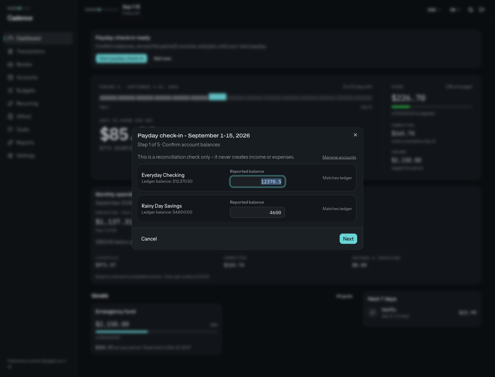

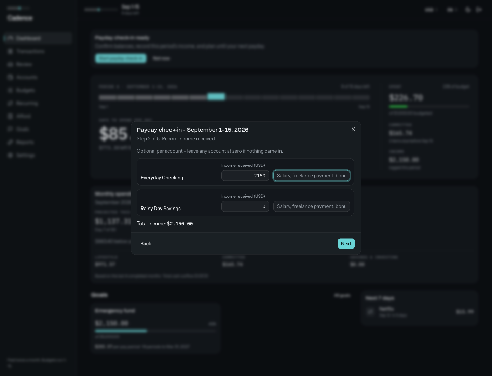

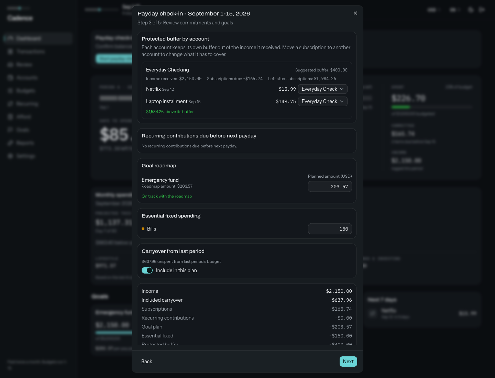

The **protected buffer is per account**, not one global number. Each account that
received income keeps its own buffer — a configurable percentage of that account's
income or a fixed minimum, whichever is larger — and the step measures it against the
subscriptions charged to that account. If one account would end below its buffer,
the wizard says how far, suggests the account with the most room, and lets you move a
subscription there without leaving the dialog (the change is saved to the recurring
item itself). **Goal funding is per account too**: each dated goal's roadmap amount
is recommended from the accounts that still have money to spare after their
subscriptions and their own buffer, in proportion to how much room each one has,
never more than an account has, and with a shortfall called out when the room across
every account can't cover the goal. Goals are placed in the order they appear (oldest
first), each taking its share out of the pool before the next is placed, so two goals
are never pointed at the same money. Every account's share is editable in that
account's currency; the goal's total is their sum, and confirming writes one
allocation row per goal and account. Recurring contributions, goal funding,
essential fixed categories, and last period's unspent carryover are then set aside,
and what's left is available for flexible categories. A plan that ends in deficit,
or with a zero buffer, can still be confirmed — but only after an explicit
acknowledgement.

### Budgets and safe-to-spend

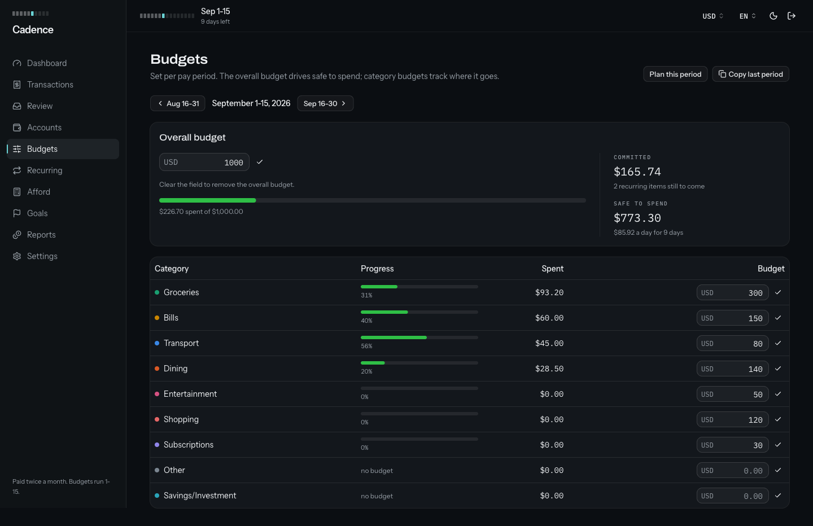

Set an overall budget per period, or let it fall back to the sum of category
budgets. The budget is net of commitments: safe-to-spend is the period budget minus
flexible spending so far, divided by the days remaining. Charges posted by recurring
items and spending in the subscription and savings categories don't eat into it —
the payday check-in already set that money aside. "Plan this period" opens the
check-in from here; "Copy last period" carries a previous budget forward.

### Transactions

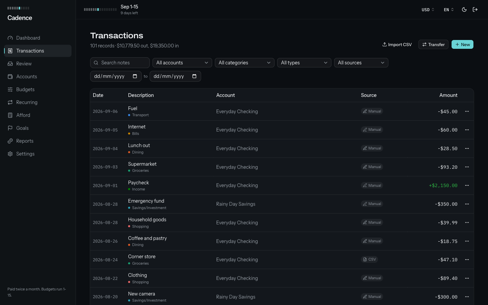

Manual entry, transfers between your own accounts (linked debit/credit rows that
never count as income or expense; between accounts in different currencies you can
declare the amount the bank actually credited, and the receiving leg records
exactly that instead of a converted figure), external transfers (money leaving to
or arriving from somewhere Cadence doesn't track), and CSV import with a
date-format picker for bank exports that don't use ISO dates. Imports run through
deterministic merchant-name categorization rules and a review step that can group
repeated rows into a recurring item or record a pair as a transfer. Rows that match
a CSV row already in the ledger (same account, date, amount, currency and
description) are shown as possible duplicates and skipped unless you import them
anyway, so re-importing an overlapping statement adds nothing twice. Every row
shows where it came from: manual, CSV, Gmail, Outlook, a payday check-in, an
opening balance, or automatic recurring posting.

### Review queue

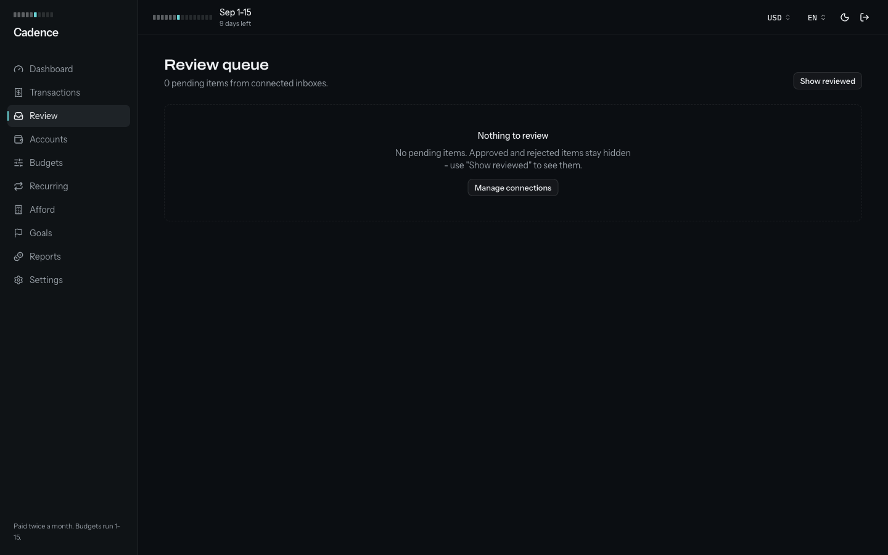

Connect Gmail and/or Outlook and transactional emails are parsed into a staged queue.
Pick an account, adjust the category or amount, then approve or reject each one.
Nothing from email becomes a real transaction until you approve it — and if an
approved receipt is the charge a recurring item was about to post, posting notices
and skips the duplicate.

### Accounts

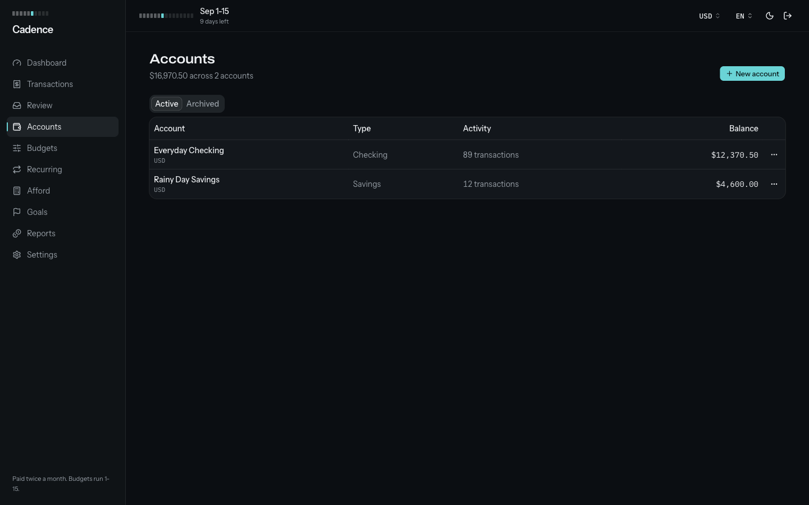

Checking, savings, cash, and other account types, each in its own native currency.
Set an opening balance per account to seed its starting point before tracked
transactions begin (exactly one per account, enforced by the database). Once an
account has other transactions the opening balance is fixed; "Correct starting
balance" in the account's menu records what was already there as an incoming
external transfer dated at the start, which raises the balance the same way without
counting as income or spending. Archive an account you no longer use; its history
stays.

### Recurring

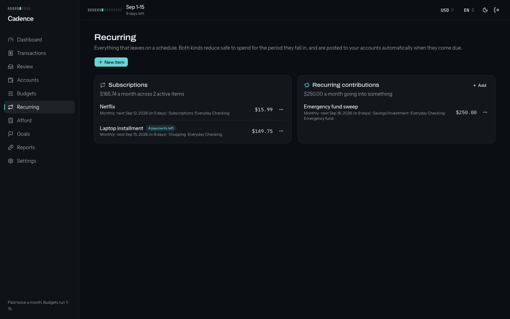

Subscriptions (bills going out) and recurring contributions (money you put into a
goal on a schedule). Both reduce safe-to-spend for the period they fall in, and both
**post automatically** when they come due: a subscription becomes an expense on its
account; a contribution becomes the same expense plus a logged contribution to its
goal, converted once into the goal's currency. A daily Vercel Cron
(`/api/cron/recurring`) does the posting, and opening the app runs the same catch-up,
so a day the cron missed is never lost. Monthly and yearly items keep their anchor
day (an item due on the 31st is charged on the 28th in February and back on the 31st
in March). An item missing its account or goal, or pointing at an archived account,
is flagged here and skipped rather than posted; so is a contribution to a goal that
is already fully funded, which resumes on its own if the goal's target is raised. A
finite item — an installment plan recorded from Afford, or any item given a "Payments
left" count — shows how many payments are left and switches itself off after the last
one, showing as finished rather than paused. "Mark as paid off" ends a plan early when
the remainder was settled outside the app; a finished plan restarts only by editing
its payments left.

### Afford

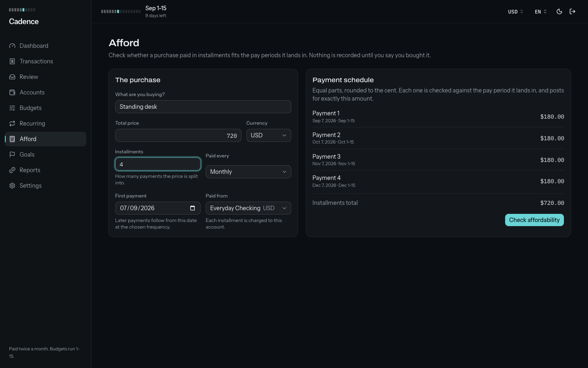

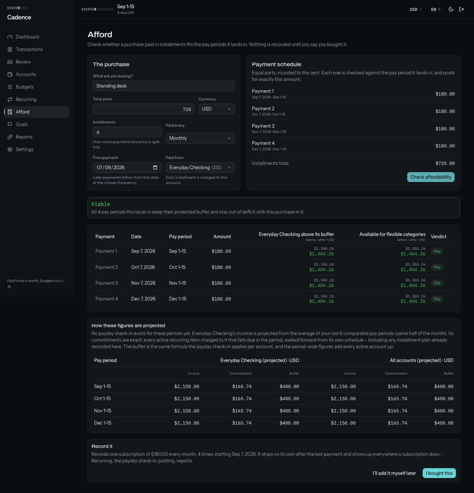

Type in a purchase, its price, how many installments, how often, the first payment
date, and the account each installment is charged to. Cadence splits the price into
equal parts, places each on the pay period it lands in, and runs two checks per
period: the chosen account stays at or above its own protected buffer, and the
period's available-for-flexible figure stays out of deficit. Installments landing in
the same period are checked together. Because those periods haven't happened yet,
income is projected from the average of your last six comparable periods (same half
of the month) while commitments are exact — every active recurring item's occurrences
in that period, including installment plans already recorded here. Nothing is written
until you press **I bought this**, which records one self-limiting recurring
subscription for the schedule shown; a shortfall verdict has to be acknowledged
first.

### Goals

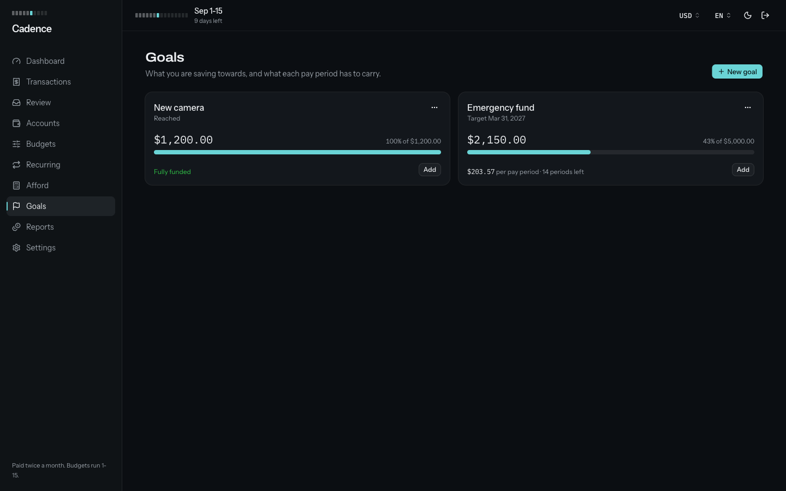

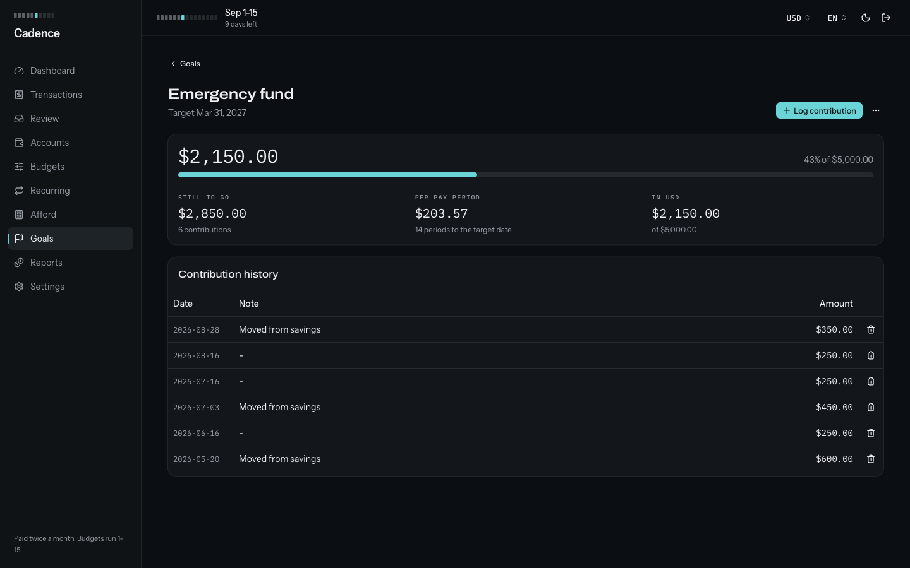

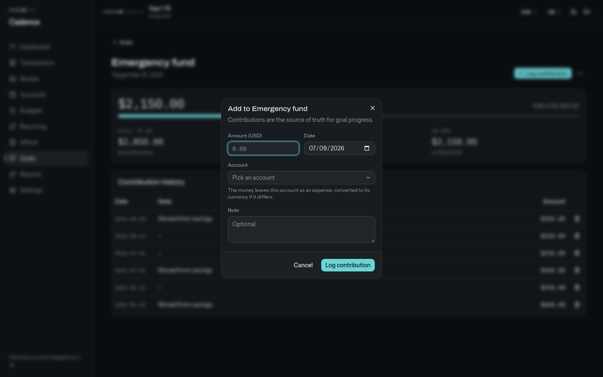

Target amount, optional target date, and a roadmap of what each pay period needs to
carry — net of any recurring contribution already scheduled for that goal, so the
check-in never reserves the same money twice. A contribution logged by hand moves
real money: you pick the account it leaves, and Cadence writes the matching expense
in that account's currency alongside the contribution (the pair is deleted together
too). Auto-posted contributions from recurring items land here as well; their amount
can be corrected in place, which updates the ledger row they wrote, and removing one
from either side removes both. A goal that reaches its target is marked as achieved.
Deleting a goal removes its contribution history but leaves the expenses those
contributions wrote in the ledger as ordinary, editable transactions.

### Reports

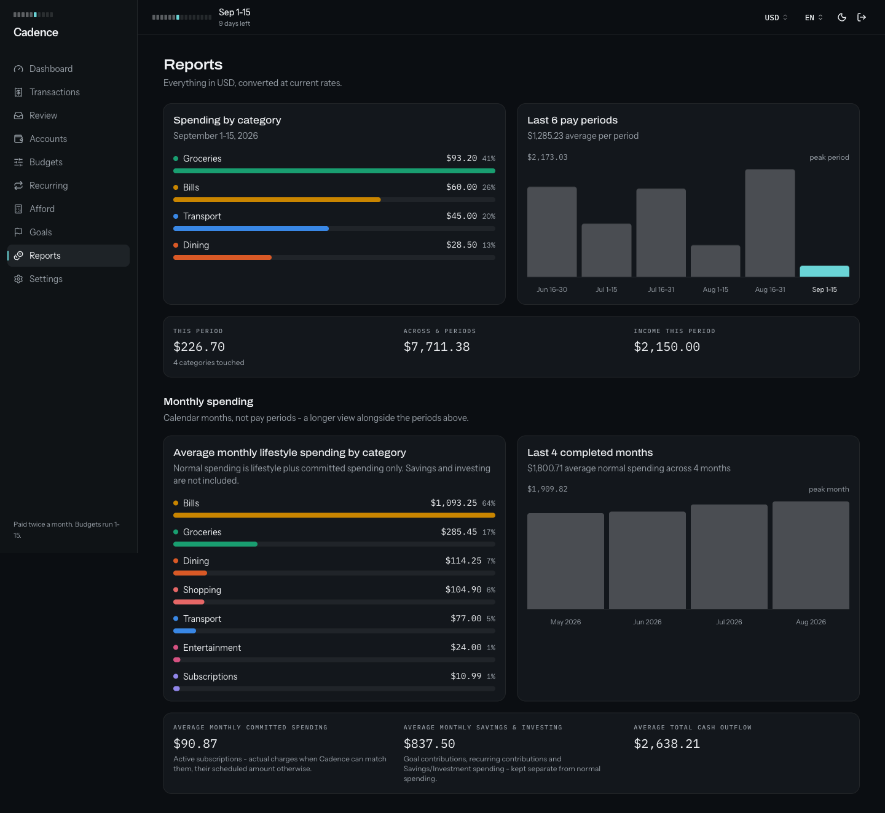

Current-period spending by category, a six-pay-period trend, and a calendar-month
view: average monthly lifestyle spending by category, the last completed months, and
the averages for committed spending, savings and investing, and total cash outflow.

### Settings

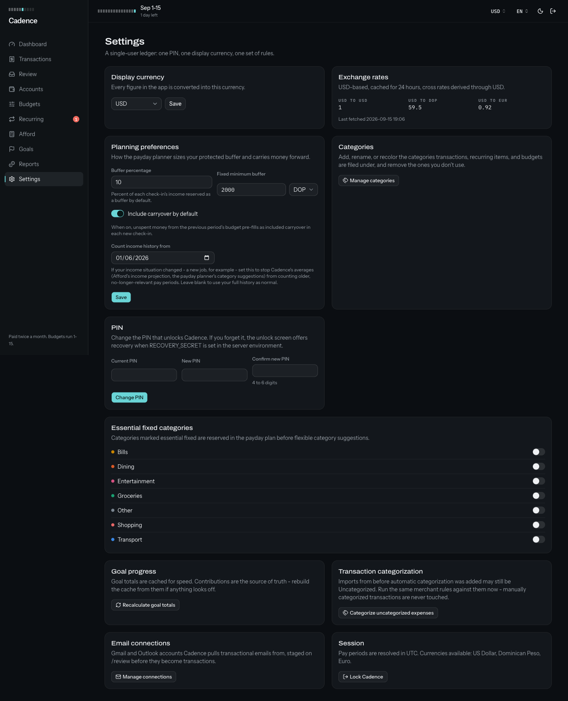

Display currency; the cached exchange-rate table; how the payday planner sizes the
protected buffer (percentage of income and a fixed minimum) and whether carryover is
included by default; category management; changing the PIN; which categories count
as essential fixed spending; goal-total recalculation; categorizing older imports;
Gmail/Outlook connections; and locking the app.

Categories (Settings → Manage categories) can be added, renamed, and recolored at
any time. A category's kind (expense or income) can only change while nothing is
filed under it. Removing a category that transactions, recurring items, or budgets
still use opens a reassignment step first: the rows move to a category you pick, the
removed category's per-period budgets are cleared, and only then is it deleted, all
in one database transaction. The two categories whole calculations hang off
(Subscriptions, which safe-to-spend treats as already set aside, and
Savings/Investment, where the monthly pace and manual goal contributions file
saving) can be renamed but never removed.

### Multi-currency, localization, and the PIN gate

Every account, transaction, recurring item, and goal is recorded in DOP, USD, or
EUR. Changing the display currency only changes how figures are presented
everywhere; it never converts or mutates what was recorded. Conversions use cached,
periodically refreshed USD-based rates, and a stale rate table is flagged on every
page. The interface is available in English and Spanish, switchable from the top
bar, alongside a dark/light theme toggle. Access is a single PIN-protected session;
every route except login is protected server-side. The PIN can be changed from
Settings (current PIN required), and a forgotten one can be replaced from the unlock
screen by whoever holds the server's `RECOVERY_SECRET`, when that variable is set.

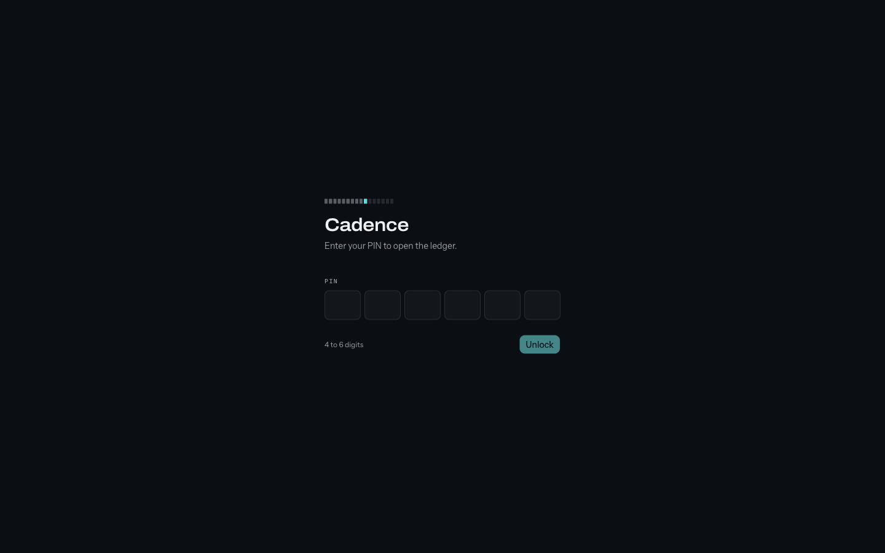

## How it works

1. Create the accounts you actually use (checking, savings, cash, etc.), with an
   opening balance if you're not starting from zero.
2. Enter transactions manually, import a CSV, or connect Gmail/Outlook and approve
   the staged items on `/review`.
3. Add recurring subscriptions and contributions, tied to the account each one is
   charged to (and, for a contribution, the goal it feeds). From then on they post
   themselves on their due dates.
4. Create savings goals and follow their per-pay-period roadmap; log contributions
   from a real account when you move money by hand.
5. On payday, run the check-in: reconcile balances, record income, review the
   per-account buffer, commitments, and per-account goal funding, set flexible
   category budgets, confirm.
6. Before an installment purchase, run it through Afford; if you buy it, record it
   there and it becomes a recurring item with a countdown.
7. Watch the dashboard's safe-to-spend per day through the period.

## Tech stack

| Area | Technology |
| --- | --- |
| Frontend | Next.js 16, React 19, TypeScript |
| Styling | Tailwind CSS, shadcn/ui |
| Database | PostgreSQL / Supabase |
| ORM | Prisma 7 |
| Email ingestion | Gmail API, Microsoft Graph, Claude structured extraction |
| Deployment | Vercel |
| Scheduling | Vercel Cron |

## Getting started

Requires Node 20.19+ and a PostgreSQL database (Supabase works — use the direct or
session-pooler connection string).

```bash
git clone <this-repository>
cd FinanceApp
npm install                 # runs `prisma generate` afterwards
cp .env.example .env        # then fill in DATABASE_URL and SESSION_SECRET
npm run db:migrate          # applies prisma/migrations to the database
npm run db:seed             # inserts the default categories
npm run dev
```

Open `http://localhost:3000`, choose a 4–6 digit PIN on first run, and the app is
ready to use. Email automation (Gmail/Outlook) is optional — see
[PHASE2.md](./PHASE2.md) for that setup.

### Scripts

| Script | What it does |
| --- | --- |
| `npm run dev` | Development server |
| `npm run build` / `npm start` | Production build and server |
| `npm run typecheck` | `next typegen && tsc --noEmit` |
| `npm run lint` | ESLint |
| `npm run db:migrate` | `prisma migrate deploy` |
| `npm run db:seed` | Seeds the default categories (idempotent) |
| `npm run db:studio` | Prisma Studio |
| `npx tsx scripts/verify-domain.ts` | Domain checks (pay periods, safe-to-spend, posting, payday, Afford, currency, CSV). Writes and then deletes rows, so run it with `DATABASE_URL` pointed at a scratch database |

## Environment variables

Values must never be committed — `.env*` is gitignored except `.env.example`.
`APP_TIMEZONE` should be set to `America/Santo_Domingo` (its default), since that's
the authoritative source for "today" and pay-period boundaries.

| Variable | Required for | Purpose |
| --- | --- | --- |
| `DATABASE_URL` | Core app | Runtime PostgreSQL connection string |
| `DIRECT_URL` | Core app (CLI) | Session-capable connection used by the Prisma CLI for migrations/seeding. On Supabase this must be the session pooler; the transaction pooler hangs on migrations |
| `SESSION_SECRET` | Core app | Signs the session cookie |
| `RECOVERY_SECRET` | Core app (optional) | Enables "Forgot your PIN?" on the unlock screen; entering it sets a new PIN without the old one. Unset hides the recovery path |
| `APP_TIMEZONE` | Core app | IANA timezone for resolving pay periods; defaults to `America/Santo_Domingo` |
| `CRON_SECRET` | Core app / Email automation | Bearer token required by both cron routes (`/api/cron/recurring` posts due recurring items; `/api/cron/ingest` syncs email) |
| `OAUTH_ENCRYPTION_KEY` | Email automation | Encrypts stored OAuth tokens at rest |
| `APP_URL` | Email automation (production) | Canonical production origin used to build the stable Gmail OAuth redirect URI |
| `GOOGLE_CLIENT_ID` / `GOOGLE_CLIENT_SECRET` | Email automation | Gmail OAuth |
| `MICROSOFT_CLIENT_ID` / `MICROSOFT_CLIENT_SECRET` | Email automation | Outlook OAuth |
| `ANTHROPIC_API_KEY` | Email automation | Parses transactional emails into structured data |

Full setup for the email-automation variables (Google Cloud Console and Azure app
registration steps) is in [PHASE2.md](./PHASE2.md).

## Deployment

Production runs on Vercel with a Supabase PostgreSQL database. The app connects at
runtime through the pooled (transaction-mode) connection string, while Prisma
migrations go through the session pooler — the transaction pooler hangs on DDL. The
Vercel build does not run migrations, so apply a new migration to Supabase before
deploying the code that needs it. Environment-variable changes in Vercel only take
effect on the next deploy. `vercel.json` schedules two daily crons: email ingestion at
04:00 UTC and recurring posting at 04:15 UTC. See [DEPLOY.md](./DEPLOY.md) for the
full walkthrough.

## Current limitations

- Email ingestion supports Gmail and Outlook only; PayPal ingestion is intentionally
  not included. Email-derived transactions are staged for review and never become
  real transactions without approval.
- A mailbox's first sync may need several runs to catch up, since ingestion caps
  each run at a limited batch per mailbox.
- No direct bank synchronization.
- No native mobile app; the responsive web app works from mobile browsers.
- Both crons run once a day; the in-app "Sync now" button and simply opening the app
  cover the gaps for email and recurring posting respectively.
- A long recurring backlog (an item untouched for months) catches up at most 24
  occurrences per run; the rest post on the following runs.
- Afford projects future income from history, so an account with no comparable-period
  income is judged on its buffer floor alone.

## Project status

Cadence is an actively used personal project. Manual tracking, CSV import, budgets,
the payday check-in, automatic recurring posting, Afford, goals, reports, and
reviewed Gmail/Outlook ingestion are all implemented. It is not a public or
commercial service — see [PHASE2.md](./PHASE2.md) for the email-ingestion layer and
what it deliberately leaves out.

## Security notes

- Access is gated behind a single PIN; every route except `/login` requires an
  authenticated session, and the cron routes require a bearer secret.
- Gmail and Outlook connections request read-only scopes; stored OAuth tokens are
  encrypted at rest.
- Emails are parsed into a staged review queue — nothing from email is written as a
  real transaction without explicit approval. Recurring items and Afford plans post
  automatically only after you have created and confirmed them.
- Never commit `.env*` files; `.env.example` is the only one tracked in git.
- Cadence is a personal tracking tool, not professional financial advice or a
  bank-grade financial institution.

## License

Private personal project — no license has been specified yet.
