# Cadence

Cadence is a single-user personal finance dashboard built around a twice-monthly pay
cycle instead of the calendar month. Budgets, safe-to-spend, goal roadmaps and the
affordability check are all computed per pay period — **Period A: 1st–15th** and
**Period B: 16th–end of month** — so the numbers match how you actually get paid.

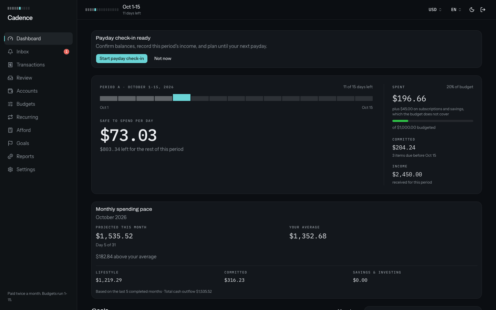

*Every screenshot and example in this README comes from a throwaway database seeded
with fictional data, shown in USD.*

## Why Cadence

Most budgeting apps assume one paycheck a month. Cadence assumes two, and builds
everything else around that:

- Twice-monthly budgeting, split at the 1st–15th and 16th–end boundaries. The pay for
  the 16th–end lands on the 15th and the pay for the 1st–15th at the end of the month
  before, each pulled back to the Friday when it falls on a weekend.
- A guided payday check-in that reconciles balances, records income, and plans each
  period's protected buffer, commitments, goal funding and category budgets per account.
- A safe-to-spend-per-day figure from the period budget and what has been spent.
- Recurring subscriptions and contributions that post themselves on their due dates.
- An Afford calculator that checks an installment purchase against every pay period it
  lands in before you commit to it.
- Savings and debt goals with a per-pay-period roadmap, funded from real accounts.
- USD, DOP and EUR as first-class currencies: every amount is stored in its account's
  currency, and the display currency only changes how totals are presented.
- Manual entry and CSV import as the baseline, with optional reviewed Gmail/Outlook
  ingestion on top.
- English and Spanish, dark and light themes, a phone layout and a tablet one.
- Single-user and privacy-conscious: nothing enters the ledger that you did not set up.
  Review happens once, when you confirm a plan (a recurring item, an Afford plan, a
  check-in, an emailed receipt); after that its rows post on schedule.

## The rules every screen shares

A handful of rules are decided in one place and read everywhere, so the Dashboard,
Budgets, the check-in, Afford, Goals and Reports never disagree.

- **The period clock.** "Today" is a civil day in `APP_TIMEZONE`. The *current* period
  is the one containing today; the *plan* period is the one a check-in opened today
  plans for — the next one from the day the current period's pay lands, otherwise the
  current one. Spending so far reads the current period; money already planned (the
  check-in, goal pages, roadmaps) reads the plan period.
- **Period commitments.** A period's commitments are every recurring occurrence due in
  it, each in one of three states: posted (its row is in the ledger), paid by a charge
  you entered, or still to come. An item that cannot post (no account, an archived
  account, a goal already reached) is listed but never counted. The hero, Budgets,
  the check-in, Afford and the goal plan all read this one list.
- **Period income.** A period's income is the money that funds it: the check-in's
  paycheck, plus any ordinary deposit from five days before the period starts (pay
  often lands early) until the next period's window opens. One-off income and paybacks
  of a shared expense count on the day they arrive and are never projected.
- **Budget spending.** What counts against a period's budget is every expense that
  does not stand for a recurring occurrence and is not a goal contribution's own
  expense, at your share when it was shared. The category rows add up to the total.
- **One history window.** Every average over past periods — Afford's income
  projection, the check-in's category suggestions, Reports' per-period average, the
  monthly pace — reads complete periods only, from your first recorded spending (a
  partial first period is skipped; payments posted in one go for past dates do not
  move it back) and, if set, from Settings' **Count history from** date.
- **Money in the account's currency.** A transaction is stored in its account's
  currency. An amount entered, imported, approved or posted in another currency is
  converted once, at that day's rate, with the entered amount and the rate kept beside
  it, so a balance never moves with the exchange rate.
- **Rate fitness.** A conversion is only written down with a rate fit for it: USD needs
  none; DOP needs Banco Popular's published sell rate from the last seven days; EUR
  takes the bank's EUR rate or a market rate fetched within the last day. When no fit
  rate exists the write is refused with nothing saved, and the form says so. Screens still show estimated totals on an older
  table, and a notice says so only when the table is not fit for the currencies you
  actually hold.

## Features

### Dashboard

The period hero shows safe-to-spend per day, spending against the period budget, what
is still committed, and income so far. Below it: the monthly spending pace against
your own average, active goals, and everything due in the next seven days. A recurring
item that cannot post, or an Afford plan that stopped fitting, raises an alert here.

### Inbox

Every standing signal in one place: a recurring item that cannot post, an Afford plan
whose remaining payments no longer fit, a charge pattern that looks like an untracked
bill (with "May repeat ..." when an existing item may already cover it), a goal whose
confirmed plan is behind its roadmap, and a dated goal whose pace the projected room
cannot carry before its target date. Each detector in `src/lib/insights.ts` is a pure
function that re-presents a result the app already computes, so the Inbox can never
disagree with the surface it links to.

Items are grouped as **Needs attention** (money already committed is not where the plan
says it is) and **Advisory** (nothing is blocked yet). Each carries the figures behind
it, a link to where it is resolved, and **Dismiss**, keyed by what the item was made
of — the period for a goal or an Afford plan, the reason for an item not posting — so a
later or different problem shows up as a new item rather than staying hidden. Dismissing
changes nothing else, and the nav badge always counts exactly what the page lists.

### Payday check-in

A five-step planner: **confirm balances → record income → commitments and goals →
flexible categories → confirm.** Every recommended figure is recomputed on the server
when you confirm, and a second tab that changed the plan in between is caught rather
than overwritten. The wizard opens from the Budgets page for any period, so a missed
period can be planned late and a confirmed one revisited.

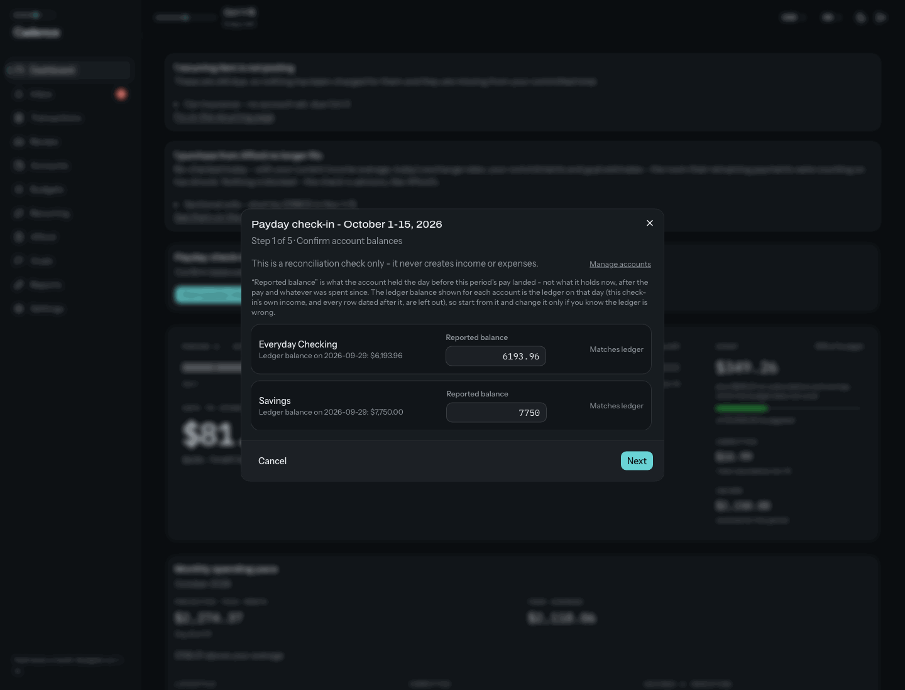

**Step 1** asks for each account's balance *before* this period's pay landed; the
ledger figure is usually the right answer. **Step 2** records the income per account,
with an optional one-off part (a bonus) that counts now but is never projected. Pay
that is already in the ledger — a CSV import of the salary, a deposit typed by hand —
is listed and **adopted**: the check-in records only what is not there yet, so the
paycheck is never counted twice. Deposits set aside for an upcoming payment (see
Transactions) are not pay and are listed apart.

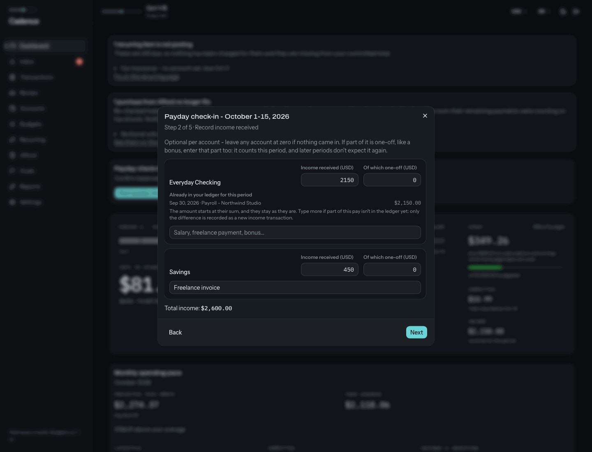

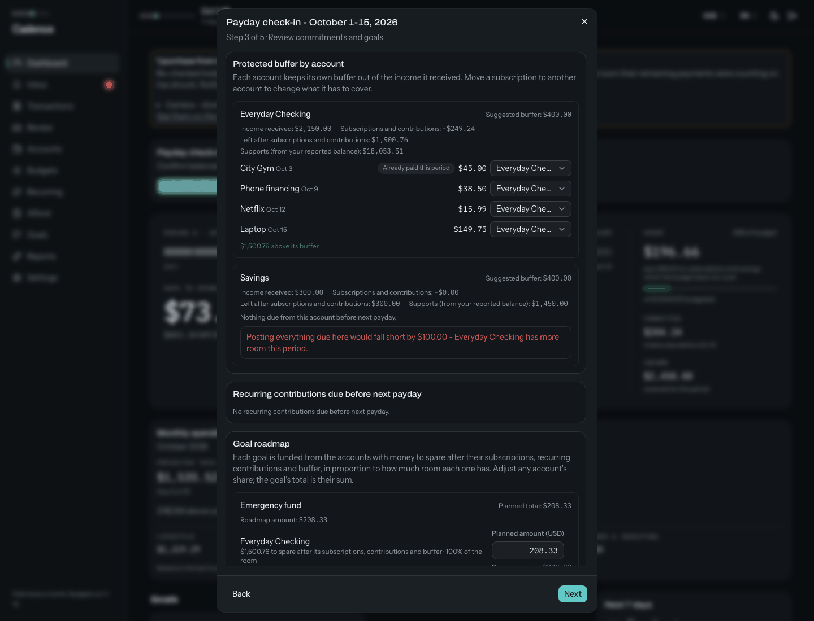

**Step 3** works per account. Each account that received income keeps its own
protected buffer (a percentage of its income or a fixed minimum, whichever is larger)
and covers the commitments charged to it, already-paid ones included and marked. If an
account would end below its buffer, the step says by how much and lets you move a
subscription to the account with the most room. Each dated goal's roadmap amount is
then recommended from the accounts' remaining room, in proportion to how much each has
spare, oldest goal first; every share is editable. Essential fixed categories and last
period's carryover are set aside too, and what is left is available for flexible
categories in **Step 4**.

When an account's reported balance was already negative before the pay — money that
left after the last payday — its row shows what it really **supports** and warns about
the gap. That gap caps "Available for flexible categories", and if Step 4 still adds up
to more, confirming scales the flexible budgets down proportionally and says so, e.g.
"scaled down from $995.00 to $342.43".


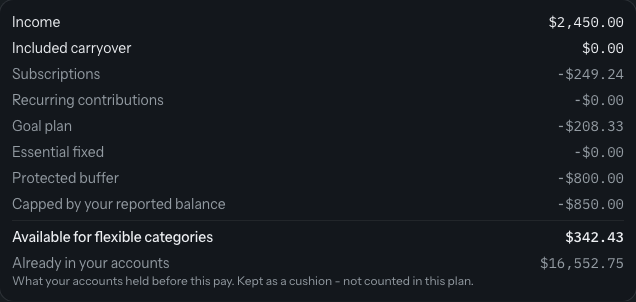

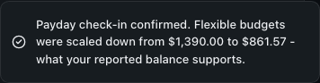

The carryover offered to the next period is what this period left unspent of its
flexible room; it is provisional while the period runs and settles on the first visit
after it ends. A plan that ends in deficit, or with no buffer, can still be confirmed,
after an explicit acknowledgement.

### Budgets and safe-to-spend

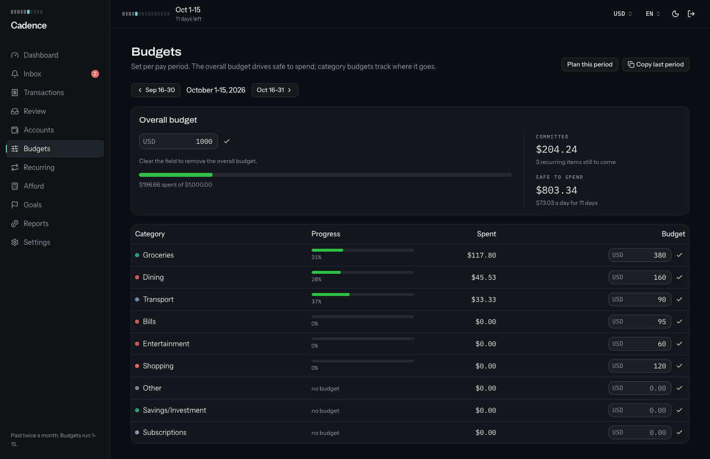

Set an overall budget per period or let it be the sum of the category budgets.
Safe-to-spend is the budget minus budget spending so far, divided by the days left.
Recurring charges, charges that paid a recurring occurrence and goal contributions
don't count against it — the check-in already set that money aside. The period switcher
steps through any period; its button reads "Plan this period", "Review this period's
plan" or "Check in for this period", and "Copy last period" carries a budget forward.

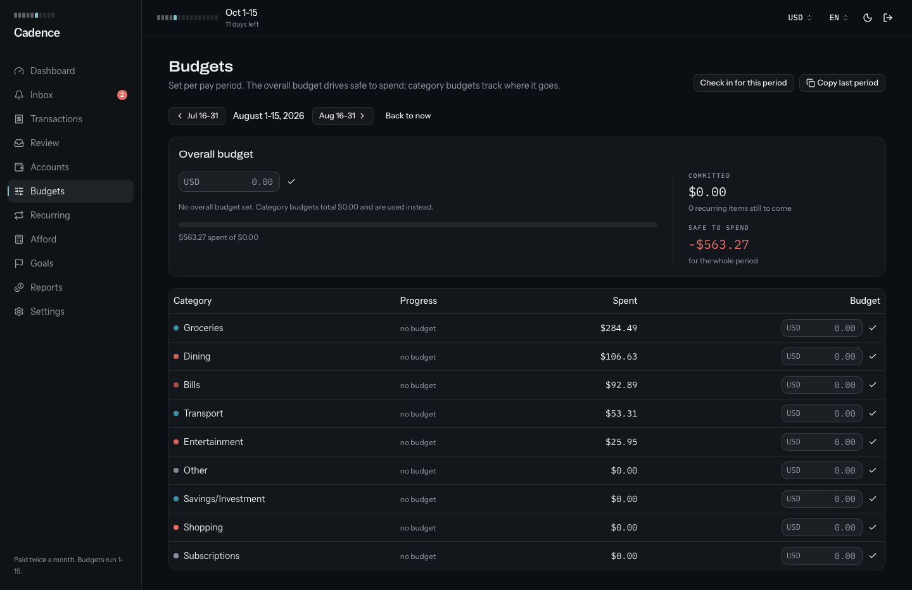

### Transactions

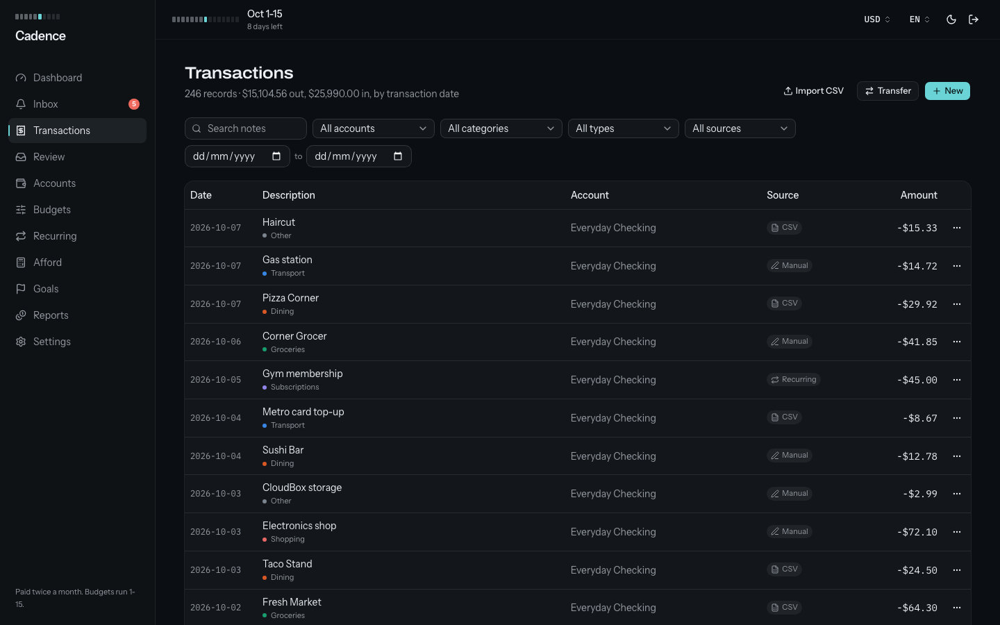

Manual entry; transfers between your accounts (never income or spending; across
currencies you can enter the amount the bank actually credited); external transfers;
and CSV import with a date-format picker, merchant-name categorization rules, and a
review step that can group repeated rows into a recurring item. A row matching one
already in the ledger is shown as a possible duplicate and skipped unless you import
it anyway. Cadence's own `transactions.csv` export re-imports through the same importer.
Every row shows its source: manual, CSV, Gmail, Outlook, check-in, opening balance or
recurring posting.

A few flags change how a row is averaged, never what it is:

- **One-off** — an unusually large expense (over three times its category's median)
  is offered as a one-off when you save it. It still counts everywhere money is a
  fact, but not in the averages that estimate typical spending.
- **Shared expense** — a USD 120 dinner paid for four keeps its full amount in the
  ledger, while budgets and averages read your USD 30 share. Paybacks are logged as
  income linked to the expense, which shows what has come back.
- **One-off income** — a gift or a refund counts as income but is never projected.
- **Set aside for an upcoming payment** — a deposit (say USD 200 from a relative
  toward a laptop installment) can be earmarked for one or more upcoming recurring
  payments on the same account. Each payment then asks that much less of the plan
  everywhere its cost is read — the check-in, Afford, the From Afford tracker, the
  room check — while the posted charge keeps the full bank amount, and the earmarked
  part is not income. Lowering or pausing the payment hands the rest back as income.

When a charge you enter (or import, or approve from a receipt) looks like a recurring
payment that already posted, or one about to post, Cadence asks rather than guessing:
"It's that payment" records the charge as that occurrence, so it never posts again;
"It's a different charge" keeps both. Nothing is matched silently.

### Review queue

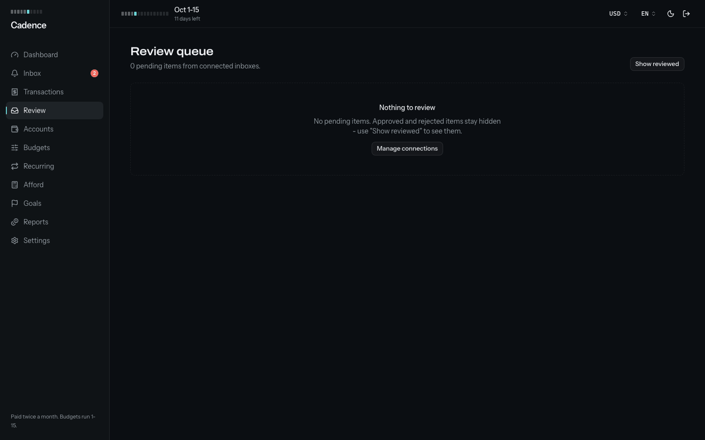

Connect Gmail and/or Outlook and transactional emails are parsed into a staged queue.
Pick the account, adjust the category or amount, and approve or reject each one.
Nothing from email becomes a transaction until you approve it.

### Accounts

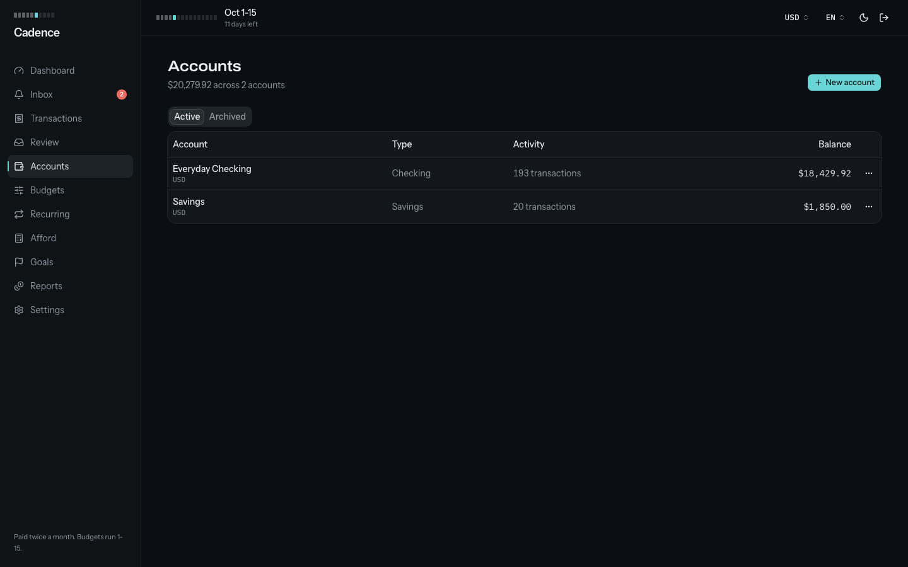

Checking, savings, cash and other accounts, each in its own currency, with one opening
balance each. "Correct starting balance" fixes the start of an account that already has
history; archiving keeps its history.

### Recurring

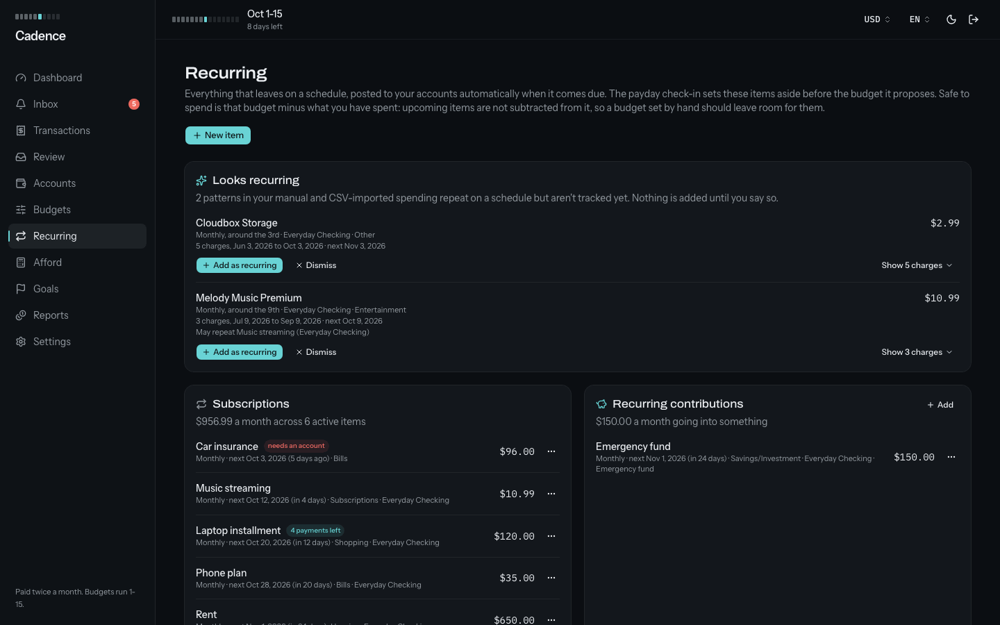

Subscriptions (bills going out) and recurring contributions (money into a goal on a
schedule), weekly, every two weeks, twice a month on two days, monthly or yearly. Both
**post automatically** through one code path: a daily Vercel Cron
(`/api/cron/recurring`) runs it and so does opening the app, so a missed day is never
lost. A subscription becomes an expense on its account; a contribution becomes that
expense plus a contribution to its goal. A charge you already entered for an
occurrence — up to five days before it is due — pays it, and nothing is posted twice.

A due date typed in the past counts the dates before today as already paid unless you
choose to post them. An item that could not post (no account, an archived account) is
moved to its next date when fixed, instead of charging the gap. A finite item — an
installment plan, or any item given "Payments left" — counts down and switches itself
off after the last payment; "Mark as paid off" ends one early. Moving a schedule never
drops a payment you already recorded: the edit is refused with the charge named until
that charge is changed or deleted.

Plans recorded from Afford's **I bought this** have their own **From Afford** section
and are re-checked on every visit against today's projections: **Still on track**, or
the first period that no longer fits and by how much ("Short by $360.00 in Nov 1-15").
The Dashboard and the Inbox list them while it lasts. Advisory only: posting is
untouched.

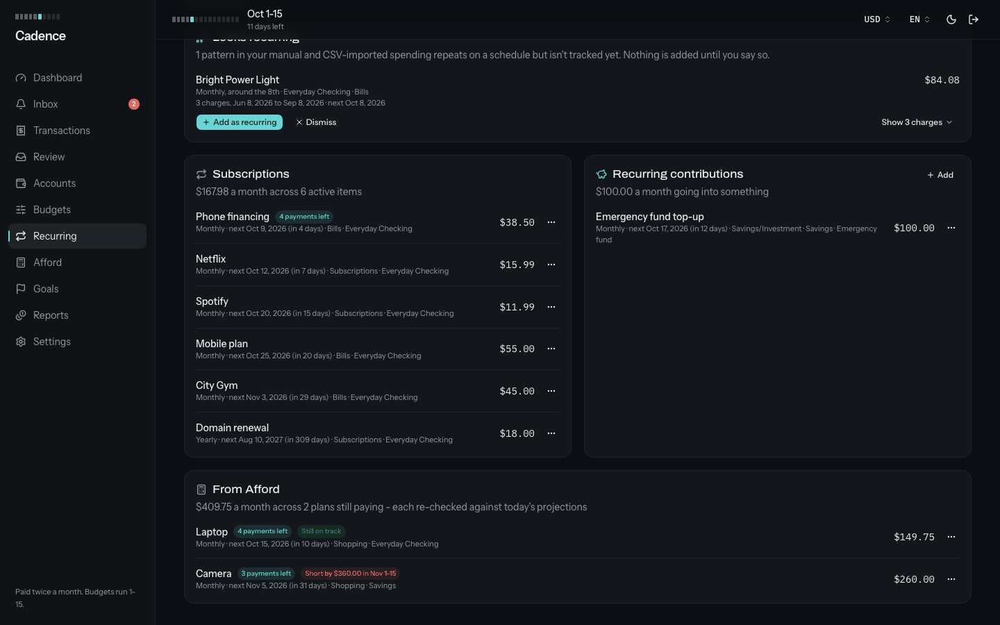

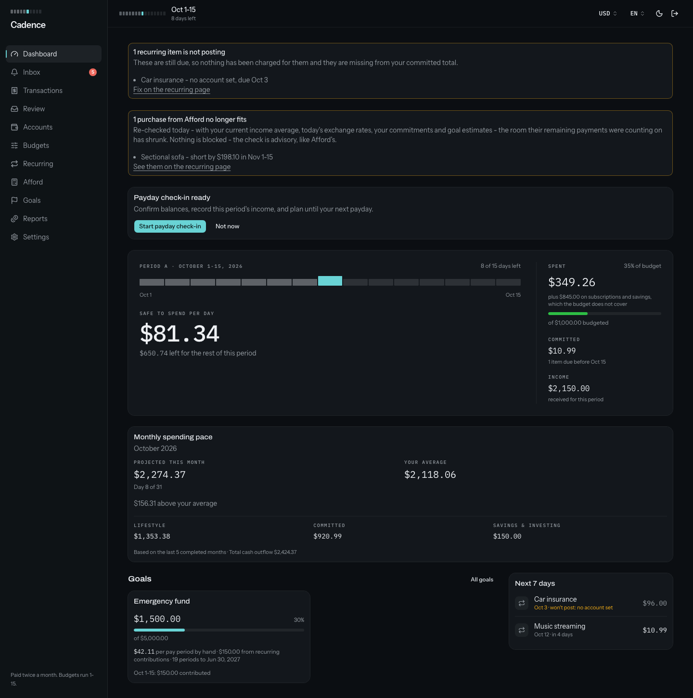

A **large subscription** (about USD 165 a charge or more; the threshold is DOP 10,000,
converted) gets a room check in the form for the period its next due date lands in:
each account's headroom before and after the charge, which keep their buffer, and the
one with the most room. It never blocks saving.

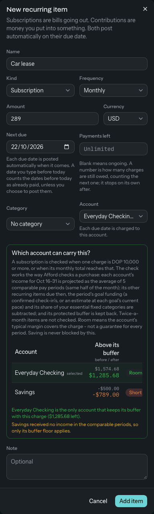

**Looks recurring** finds bills you pay but never set up: a merchant charged the same
amount (within 10%) on a schedule at least three times. Nothing is created until you
click **Add as recurring**; **Dismiss** is permanent for that merchant on that account.

### Afford

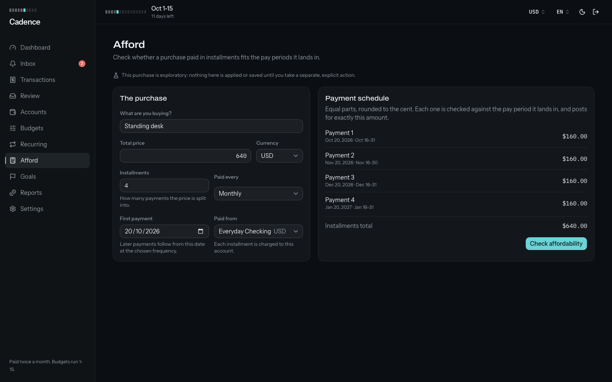

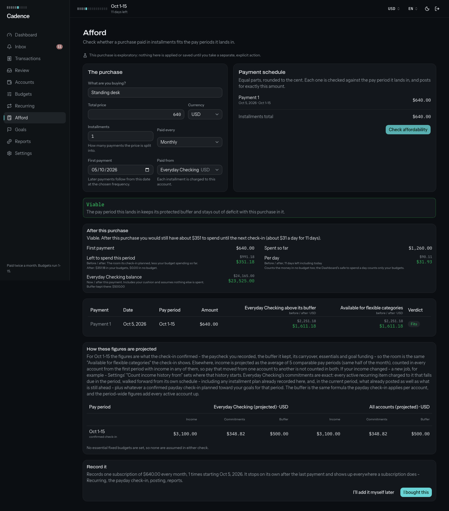

Enter a purchase, its price, the installments, how often, the first payment date and
the account. Cadence places each installment on its pay period and runs two checks per
period: the account stays above its protected buffer, and the period's available-for-
flexible figure (the check-in's own formula) stays out of deficit. Future income is
the average of your comparable periods (same half of the month, up to six) from the
history window; commitments are the period's exact occurrences; a period with a
confirmed check-in carries its real goal funding, and one without carries an estimate
of each dated goal's pace, marked as such. Installments dated before today count as
paid. Nothing is written until **I bought this**, which records one self-limiting
subscription for the schedule shown.

Under the verdict, **After this purchase** says it in plain words: about how much is
left to spend until the next check-in once the first payment is in, and per day for
the days left. That figure is the period's room less your budget spending so far, the
same amount the next check-in would offer as carryover, and it shows as "over" when
negative. The summary also shows the first payment converted at the rate the check
used, how much of what is left sits in your budgets and how much in no budget (the
per-day figure counts the no-budget money too, so it can differ from the Dashboard's
safe to spend a day, which counts only your budgets), and the paying account's
balance now and after the payment. With several payments it names
the tightest period. When the plan does not fit, it says how much the tightest period
is short and the largest payment that would still fit. If the first payment falls in
a later period, the figures use that period's projected room.

### Goals

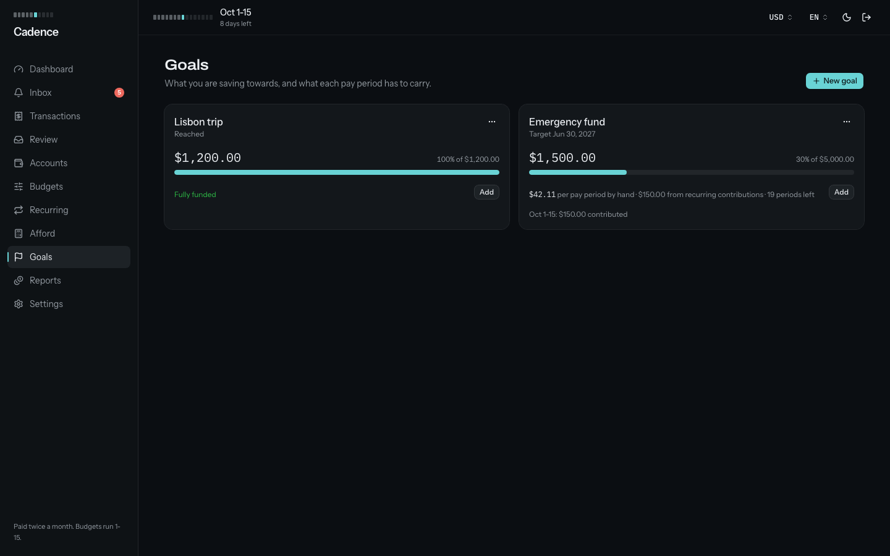

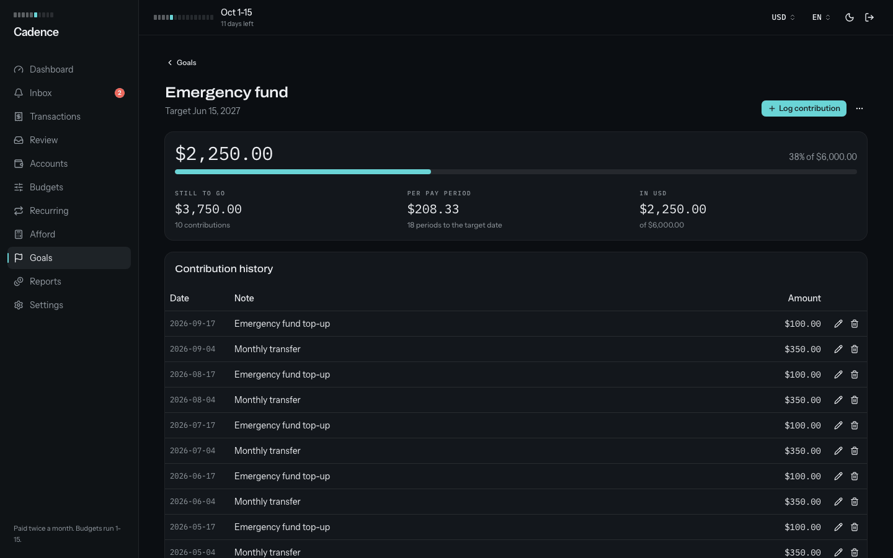

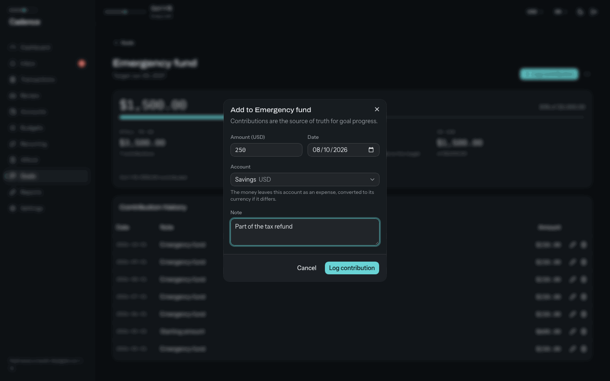

A target, an optional target date, and a roadmap of what each pay period needs to
carry, net of recurring contributions already scheduled. Goal money follows the pay: a
contribution belongs to the period whose pay was in hand when it was made. A
contribution logged by hand moves real money — you pick the account, and Cadence writes
the matching expense in that account's currency. A goal keeps its currency once it
holds contributions. After a confirmed check-in the goal page shows what the plan set
aside beside the live roadmap, and a goal behind it appears in the Inbox.

Goals marked as **debts** get a payoff comparison: an extra amount per pay period
applied largest balance first or smallest balance first, side by side, with the period
each debt finishes. It is exploratory and feeds nothing else.

### Reports

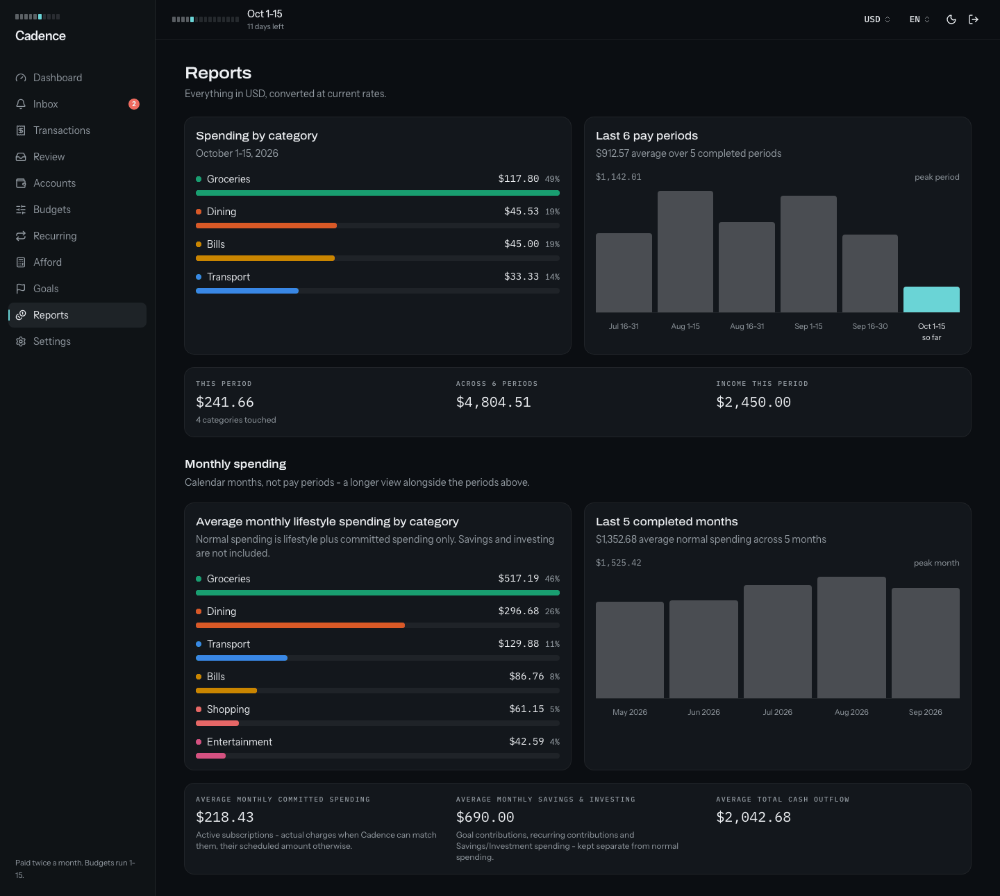

Current-period spending by category, a six-pay-period trend (the period in progress
marked "so far" and left out of the average), and a calendar-month view: lifestyle
spending by category, committed spending, savings and investing, and total outflow,
averaged over completed months from the history window. A recurring occurrence counts
in the month it was due, whatever day the charge that paid it is dated, and a yearly
item counts a twelfth of its price every month.

### Settings

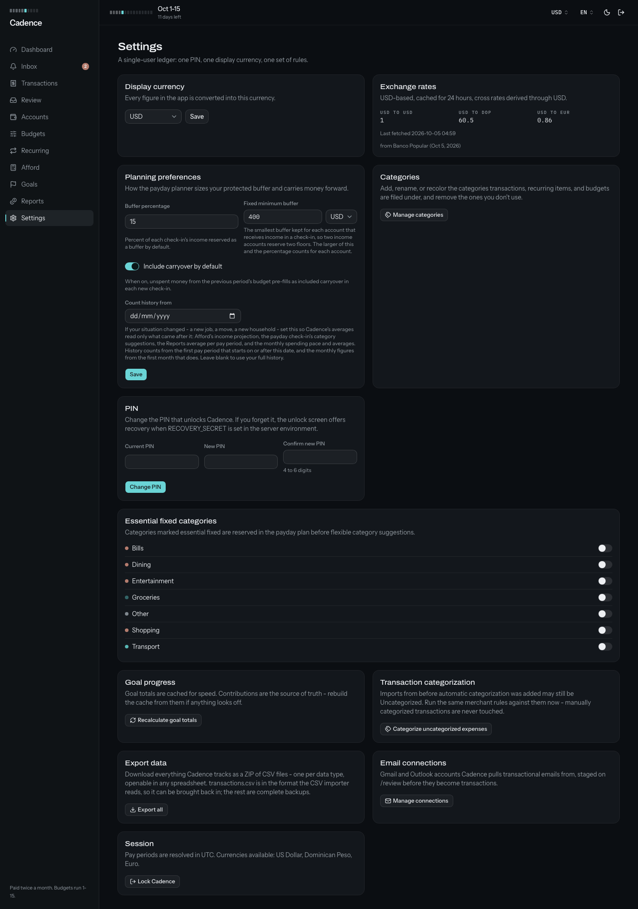

Display currency; the exchange-rate table and which source is in use; buffer
percentage and floor; carryover default; **Count history from** (for when your
situation changed and older history would only skew the averages); essential fixed
categories; category management; categorizing older imports; **Export all** (a ZIP of
CSVs, with `transactions.csv` laid out for the importer); email connections; the PIN;
and locking the app.

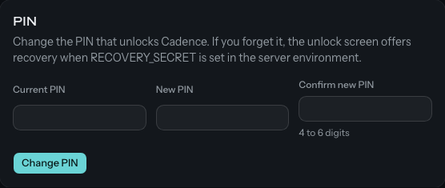

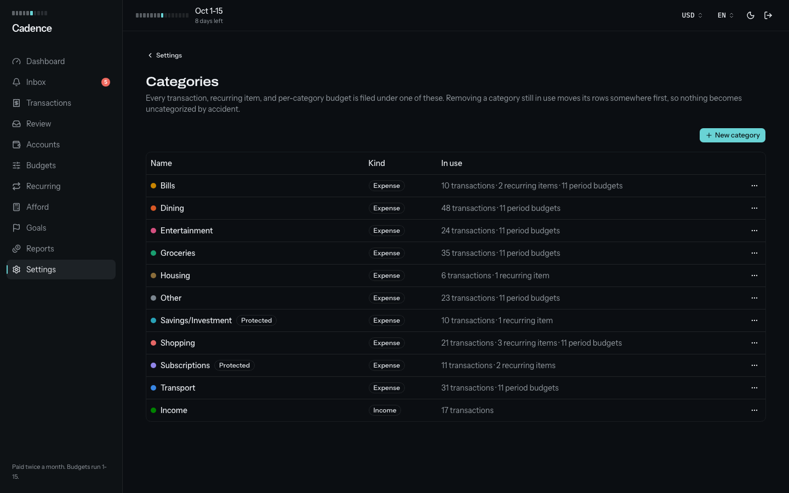

Categories can be added, renamed and recolored. Removing one still in use first moves
its transactions, recurring items and budgets to a category you pick (each budget is
added to that category's for the same period), in one database transaction. Subscriptions and Savings/Investment can be renamed but never
removed.

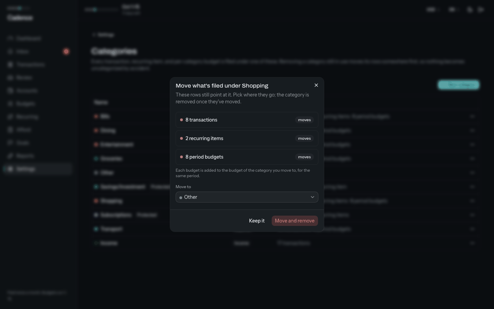

### Currencies, languages and the PIN

Every account, transaction, recurring item and goal is in USD, DOP or EUR. Market rates
come from open.er-api.com, cached and refreshed daily. For DOP and EUR, Banco Popular
Dominicano's published sell rate is preferred whenever one from the last seven days is
stored; the bank's feed blocks server-side clients, so a daily GitHub Actions job reads
it with a real browser and posts it to the app (`.github/workflows/scrape-bpd-rate.yml`,
see [DEPLOY.md](./DEPLOY.md)). The interface is in English and Spanish. Access is one
PIN-protected session; a forgotten PIN can be replaced by whoever holds the server's
`RECOVERY_SECRET`, when it is set.

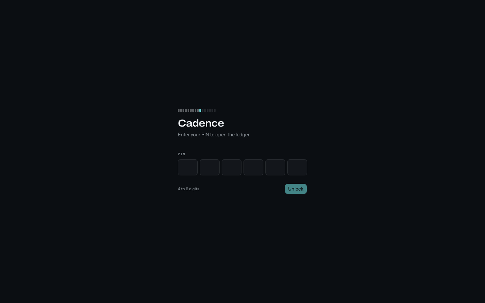

## How it works

1. Create your accounts, with an opening balance if you're not starting from zero.
2. Enter transactions, import a CSV, or connect Gmail/Outlook and approve the queue.
3. Add recurring subscriptions and contributions; from then on they post themselves.
4. Create goals and follow their per-pay-period roadmap.
5. On payday, run the check-in.
6. Before an installment purchase, run it through Afford.
7. Watch safe-to-spend per day through the period, and the Inbox for anything that
   needs a decision.

## Tech stack

| Area | Technology |
| --- | --- |
| Frontend | Next.js 16, React 19, TypeScript |
| Styling | Tailwind CSS, shadcn/ui |
| Database | PostgreSQL / Supabase |
| ORM | Prisma 7 |
| Email ingestion | Gmail API, Microsoft Graph, Claude structured extraction |
| Deployment | Vercel |
| Scheduling | Vercel Cron, GitHub Actions (bank rate) |

## Getting started

Requires Node 20.19+ and a PostgreSQL database (Supabase works — use the direct or
session-pooler connection string).

```bash
git clone <this-repository>
cd FinanceApp
npm install                 # runs `prisma generate` afterwards
cp .env.example .env        # then fill in DATABASE_URL and SESSION_SECRET
npm run db:migrate          # applies prisma/migrations to the database
npm run db:seed             # inserts the default categories
npm run dev
```

Open `http://localhost:3000`, choose a 4–6 digit PIN on first run, and the app is ready.
Email automation is optional — see [PHASE2.md](./PHASE2.md).

### Scripts

| Script | What it does |
| --- | --- |
| `npm run dev` | Development server |
| `npm run build` / `npm start` | Production build and server |
| `npm run typecheck` | `next typegen && tsc --noEmit` |
| `npm run lint` | ESLint |
| `npm run db:migrate` | `prisma migrate deploy` |
| `npm run db:seed` | Seeds the default categories (idempotent) |
| `npm run db:studio` | Prisma Studio |
| `npx tsx scripts/verify-domain.ts` | The domain checks (the only test harness). Writes and then deletes rows, so point `DATABASE_URL` at a scratch database |
| `npx tsx scripts/verify-no-double-counting.ts` | Integrity audit over real data for five pairs of mechanisms that could count one commitment twice or drop it. Read-only at the database level, so it can be pointed at any database; exit 1 means something to investigate |
| `npx tsx scripts/backfill-account-currency.ts` | Stores older rows that were written in another currency than their account's in the account's currency (dry run by default; refuses rates not fit for writing) |
| `npx tsx scripts/scrape-bpd-rate.ts` | Captures Banco Popular's published rate with a real (headed) Chromium and posts it to the app; `--dry-run` only prints. Run daily by GitHub Actions |

## Environment variables

Values must never be committed — `.env*` is gitignored except `.env.example`.
`APP_TIMEZONE` defaults to `America/Santo_Domingo`, the source of "today" and of the
pay-period boundaries.

| Variable | Required for | Purpose |
| --- | --- | --- |
| `DATABASE_URL` | Core app | Runtime PostgreSQL connection string |
| `DIRECT_URL` | Core app (CLI) | Session-capable connection for migrations and seeding. On Supabase this must be the session pooler; the transaction pooler hangs on migrations |
| `SESSION_SECRET` | Core app | Signs the session cookie |
| `RECOVERY_SECRET` | Core app (optional) | Enables "Forgot your PIN?" on the unlock screen |
| `APP_TIMEZONE` | Core app | IANA timezone for "today" and pay periods |
| `CRON_SECRET` | Core app / Email automation | Bearer token for `/api/cron/recurring` and `/api/cron/ingest` |
| `BPD_SCRAPE_INGEST_SECRET` | Banco Popular rate scraper | Bearer token for `/api/cron/bpd-rate/ingest`; the same value goes in the repository's Actions secrets (see [DEPLOY.md](./DEPLOY.md)) |
| `OAUTH_ENCRYPTION_KEY` | Email automation | Encrypts stored OAuth tokens at rest |
| `APP_URL` | Email automation (production) | Canonical origin for the Gmail OAuth redirect URI |
| `GOOGLE_CLIENT_ID` / `GOOGLE_CLIENT_SECRET` | Email automation | Gmail OAuth |
| `MICROSOFT_CLIENT_ID` / `MICROSOFT_CLIENT_SECRET` | Email automation | Outlook OAuth |
| `ANTHROPIC_API_KEY` | Email automation | Parses transactional emails into structured data |

## Deployment

Production runs on Vercel with a Supabase PostgreSQL database: the app connects through
the transaction pooler at runtime, and migrations go through the session pooler. The
Vercel build does not run migrations, so apply a new one before deploying the code that
needs it. `vercel.json` schedules email ingestion at 04:00 UTC and recurring posting at
04:15 UTC. See [DEPLOY.md](./DEPLOY.md).

## Current limitations

- Email ingestion supports Gmail and Outlook only; email-derived transactions always go
  through review.
- No direct bank synchronization.
- Both crons run once a day; opening the app and "Sync now" cover the gaps.
- A long recurring backlog catches up at most 24 occurrences per run.
- Afford projects income from history, so an account with no comparable-period income
  is judged on its buffer floor alone.

### On your phone

On a phone the same app switches to a bottom tab bar, list layouts in place of wide
tables, bottom-sheet dialogs, and a full-screen payday check-in; a tablet keeps the
desktop layout. Captured in the iOS Simulator.

<table>
  <tr>
    <td align="center" valign="top" width="180">
      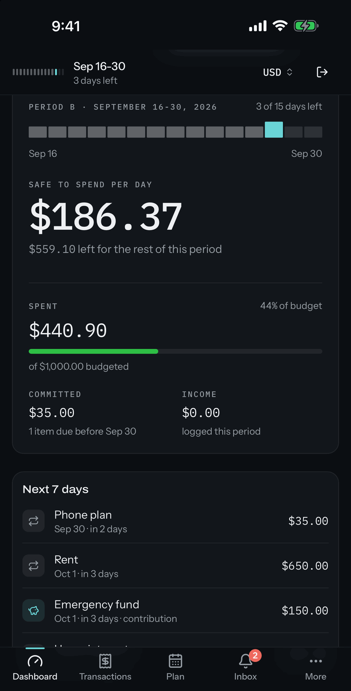
      <br><sub>Dashboard: hero figure and Next 7 days</sub>
    </td>
    <td align="center" valign="top" width="180">
      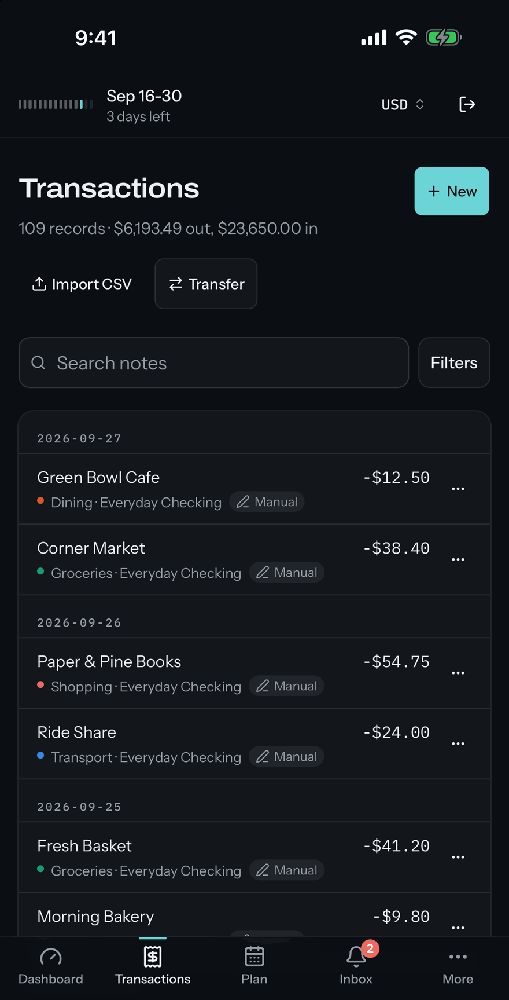
      <br><sub>Transactions: day-grouped list and Filters button</sub>
    </td>
    <td align="center" valign="top" width="180">
      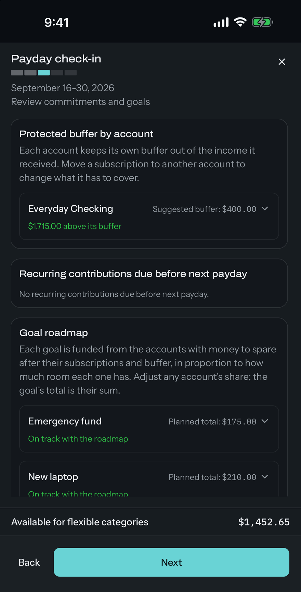
      <br><sub>Payday check-in step 3: collapsed blocks, pinned Available line</sub>
    </td>
    <td align="center" valign="top" width="180">
      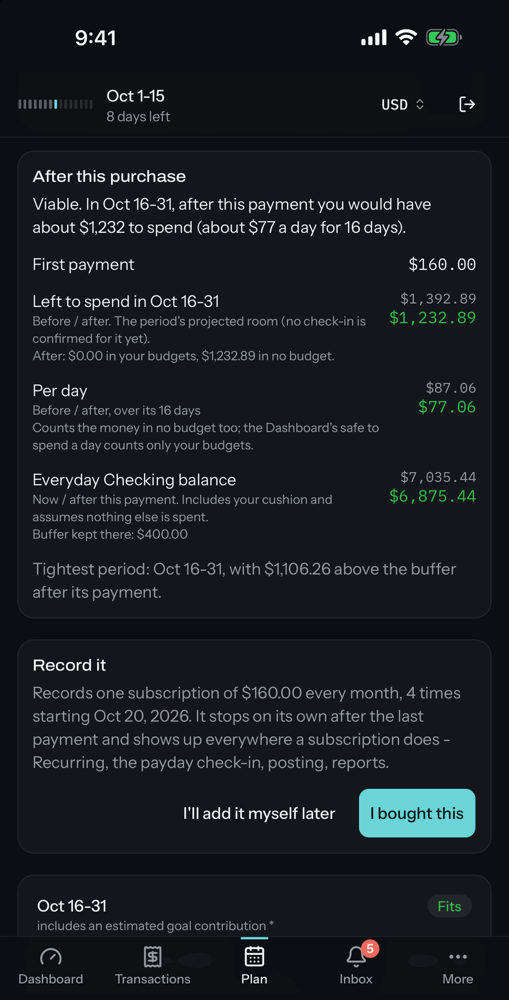
      <br><sub>Afford: Viable verdict with the Record it card under it</sub>
    </td>
    <td align="center" valign="top" width="180">
      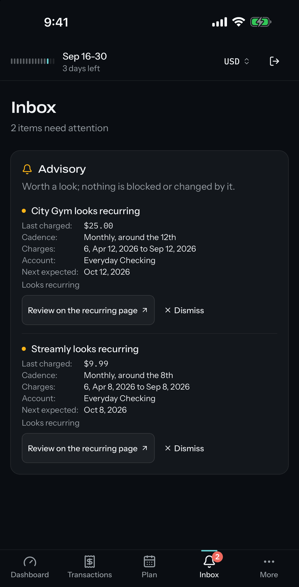
      <br><sub>Inbox: two recurring-charge suggestions</sub>
    </td>
  </tr>
</table>

<p align="center">
  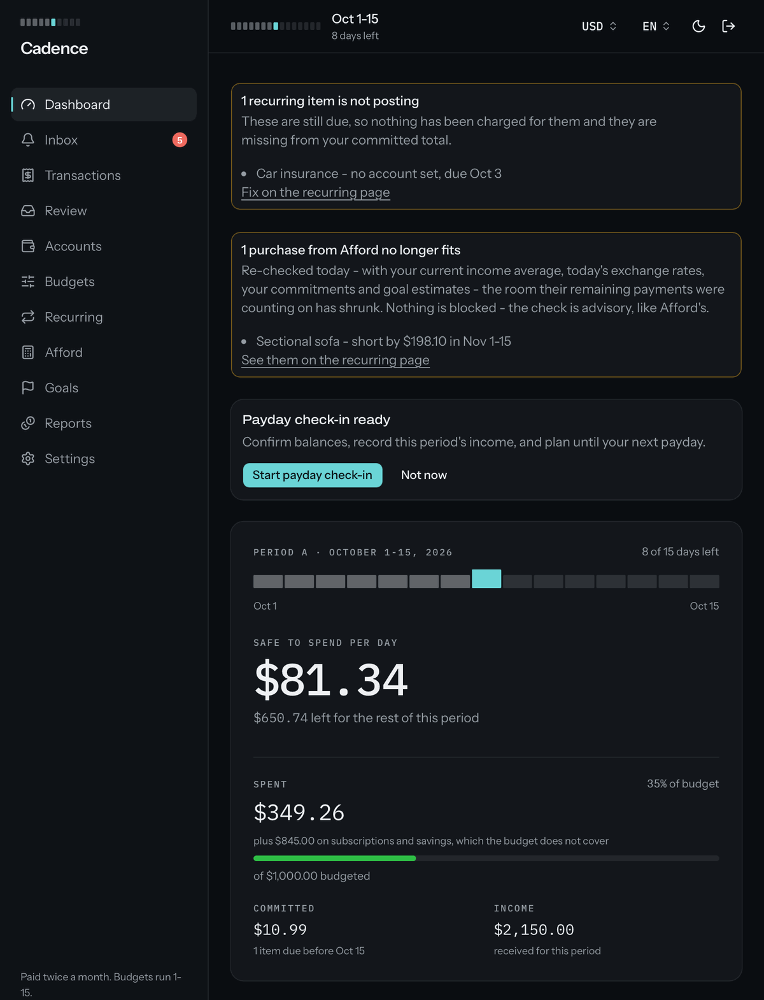
  <br><sub>The same dashboard on an iPad Air 11-inch, in the desktop layout with the sidebar</sub>
</p>

## Project status

Cadence is an actively used personal project. Manual tracking, CSV import, budgets, the
payday check-in, automatic recurring posting, Afford, goals, reports and reviewed
Gmail/Outlook ingestion are all implemented. It is not a public or commercial service.

## Security notes

- Access is gated behind a single PIN; every route except `/login` requires a session,
  and the cron routes require a bearer secret.
- Gmail and Outlook connections request read-only scopes; OAuth tokens are encrypted at
  rest.
- Nothing from email is written as a transaction without explicit approval; recurring
  items and Afford plans post only after you have created them.
- Never commit `.env*` files; `.env.example` is the only one tracked in git.
- Cadence is a personal tracking tool, not financial advice.

## License

Private personal project — no license has been specified yet.
